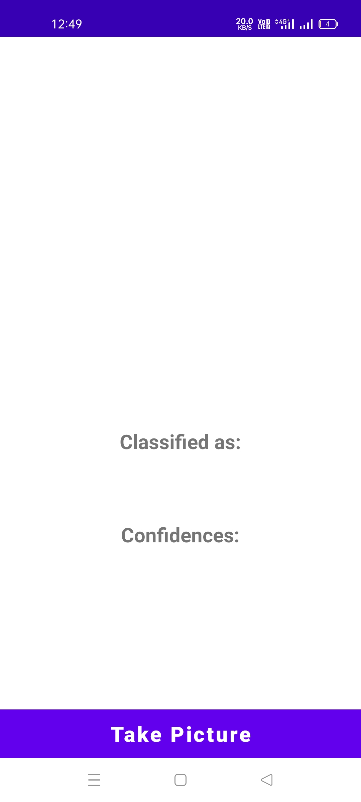
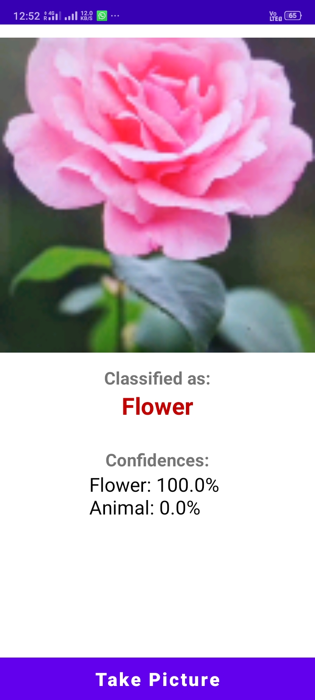
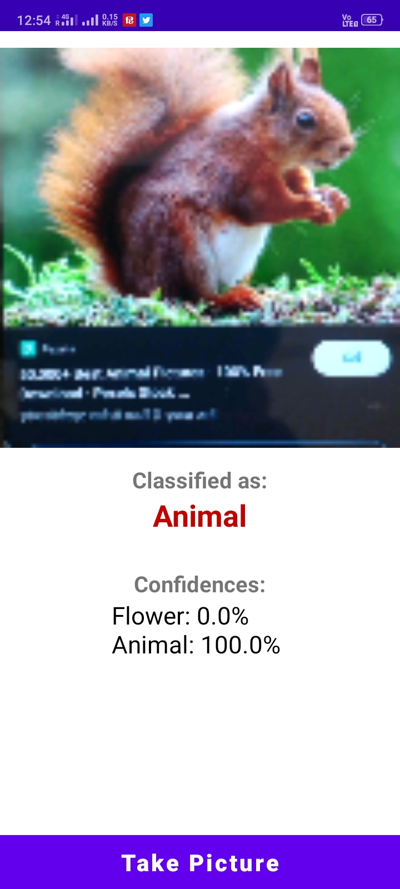

# Rak_sh_ak - The Farmer's Saviour

**An image detection app designed for the farmers to detect plant diseases and get information about it, just by clicking the image of the plant.**

# About the App

The mobile application that we are designing is named Rak_sh_ak. It is a free application that helps farmers to identify and eradicate a disease among their crops with a single click. In turn, this also helps to connect the farmers to Experts or Scientists who give their opinion regarding the treatment of disease. 
The application is very user-friendly. Farmers simply need to scan the image of a diseased crop and upload it to the application. The application then analyses the image using trained models with algorithms and within seconds users will be provided with a solution.
At present, our app uses a model that identifies and differentiates between flowers and animals. 

# Images of the current app

# How to use the App

Users have to click the picture of a flower or animal for identification. The trained model identifies the uploaded image whether it is a flower or animal. 

# Input

For the use of the app, the user has to choose a language to register himself. Registration involves details of contact number, location, and OTP verification. Farmers simply need to scan the image of a diseased crop and upload it to the application. Photo of the diseased crop is transferred to ML model, then it analyses the image using a trained model with algorithms.

# Processing

The working model of our application is straightforward; farmers will have to do registration first and create their user ID on the application. After creating their account, they can click the image of the diseased crop and upload it to the application. Disease names with their symptoms will be displayed on the screen. The ML model we are using to design the application follows the 51% rule, which means it will provide the user with the solution by comparing the accuracy of the dataset with the uploaded image. If the accuracy of the dataset is more than 51% in comparison to the uploaded image; disease names with their symptoms will be provided, and this service will be available in both online and offline mode. If the accuracy of the dataset is less than 51% then the online ML Model will find the solution in the general solution repository and the related image results will be provided as output if in case the disease is not found then this unavailable diseased crop will be stored in the problem dashboard (works on basis of First in First out) which will be further answered by experts. A team of experts will analyze the problem and give the best solution to the problem, which will reach the farmer through notifications. Via user ID these solutions will be stored in the expert solution repository which will be further used by experts to forward the solution to the same problem and also can add or modify the solutions at any time. The unavailable diseased crop images will be stored as a dataset for retraining of the model. Similarly, the expert solution repository and general solution repository get updated on regular basis every twenty-four-hour. Thus, the overall online ML Model will get updated on a regular basis every twenty-four hours. If the farmers are not satisfied with the service, they can connect to the experts through chat or toll-free numbers. The collection database stores the information of farmers and their associated search history for review and improvement purposes.

# Human Intervention

If the user is not satisfied with the given solution, then they will be given an option to contact our customer support service through chat or call our toll-free number. If in case the customer support is not able to help the user then their problem will be transferred to an expert. After which they will be provided with accurate solutions to the identified disease.

# Output

After the identification of the disease, our application will provide the diseases name, symptoms, deficiency, and precise treatment for the disease and will also recommend the type of crops which should be produced in that locality as the output

# To update and increase Accuracy

Our application collects and stores all the previously searched images and given solutions by experts in the collection database for improvement and review purposes. The online ML model and online general solution repository will be trained every 24 hours through the image storage database and the expert solution repository respectively. Also, the offline ML model and offline general solution repository are updated every month through the collected data. This will be used to further improve the accuracy of the application.  

# Modes of Contribution
**The Consists of Seven Branches namely :-**

* main :- for the people who can contribute content about the current status of the project in form of README.md
* apps :- for contribution of apps in any framework you are familiar with specified folder
* backend :- for the MERN stack people who can design a great backend to support the backend functionalities
* dataset :- web scrapped or self clicked images of plant disease in disease named folders which can be used to train the model for better ML models
* ml-model :- for ML people who can provide with ML notebooks and pickle object for the same 
* plant-disease-remedies :- for people who can surf the internet about the plant diseases and contribute in text format 
* suggestions :- for people who can suggest what should be the future proceedings of our project and where should we take it for improvements in text format

**You can contribute in any branch as per your will and skill you hold**
